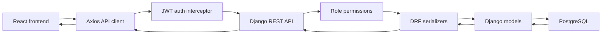

# Cafeteria Project Management System

Last updated: May 26, 2026

This repository contains a full cafeteria operations platform with a React/Vite frontend, a Django REST Framework backend, and PostgreSQL persistence. The system manages public website forms, authentication, menu operations, POS orders, inventory, employees, salaries, reporting, and admin review screens.

## System Status

Verified in this workspace:

- Frontend lint: `npm run lint` passes.
- Frontend production build: `npm run build` passes.
- Backend Django check: `python manage.py check` passes.
- Backend tests: `python manage.py test` passes with 48 tests.
- Django migrations: `python manage.py makemigrations --check --dry-run` reports no model changes.

## Technology Stack

| Layer | Technology |
| --- | --- |
| Frontend | React 19, Vite, Tailwind CSS, Axios, React Router, Framer Motion, Recharts, Lucide React |
| Backend | Django 5.0.4, Django REST Framework, SimpleJWT, django-cors-headers, WhiteNoise |
| Database | PostgreSQL |
| Deployment | Render blueprint in `render.yaml` |

## Main Modules

| Module | Frontend page | Backend/API | Database tables |
| --- | --- | --- | --- |
| Authentication | Login, protected routes, settings profile | `/api/auth/` | `accounts_customuser` |
| Dashboard | Dashboard | `/api/dashboard/stats/` | Reads orders, employees, inventory |
| Menu | Menu | `/api/menu/` | `menu_category`, `menu_menuitem`, recipe/modifier tables |
| POS orders | Menu order modal, Orders | `/api/orders/`, `/api/orders/tables/` | `orders_order`, `orders_orderitem`, `orders_table` |
| Inventory | Inventory, Reports | `/api/inventory/` | `inventory_inventoryitem` |
| Employees | Employees | `/api/employees/` | `employees_employee` |
| Salaries | Salaries, Reports | `/api/salaries/` | `salaries_salaryrecord` |
| Contact messages | Contact, Contact Messages, Settings message panel | `/api/menu/contact-messages/` | `menu_contactmessage` |
| Newsletter messages | Public footer, System Messages | `/api/menu/newsletter-subscriptions/` | `menu_newslettersubscription` |
| Job applications | Jobs public form, admin Jobs, Reports | `/api/menu/job-applications/` | `menu_jobapplication` |

## Data Flow

The full system flow is documented in [backend/docs/data_flow.md](backend/docs/data_flow.md).

Short version:



## Buttons and Tables That Save to Backend

These screens use real backend/database persistence:

- Login and Google sign-in checks use `/api/auth/`.
- Contact form saves to `/api/menu/contact-messages/`.
- Newsletter footer saves to `/api/menu/newsletter-subscriptions/`.
- Job application form saves applicant data and CV files to `/api/menu/job-applications/`.
- Menu page saves menu CRUD, item status toggles, and POS orders.
- Orders page saves new orders, status changes, and admin deletes.
- Inventory page saves stock CRUD.
- Employees page saves employee CRUD and active/inactive toggles.
- Salaries page saves payroll CRUD.
- Settings page saves user profile patches and admin user create/delete.
- Contact Messages, System Messages, Jobs, and Reports read database data and expose admin actions where allowed.

These controls are local/client-side only:

- Theme, accent color, sound choice, performance mode, and avatar preview in Settings use browser state/local storage.
- Report CSV export, print buttons, and receipts are generated in the browser from loaded API data.
- Payment modal records payment method/status with the order, but it does not call an external payment provider.

## Local Setup

### Backend

```powershell
cd backend
python -m venv venv
.\venv\Scripts\activate
pip install -r requirements.txt
copy .env.example .env
python manage.py migrate
python test_and_seed.py
python manage.py runserver
```

The API runs at `http://localhost:8000/`.

### Frontend

```powershell
cd frontend
npm install
npm run dev
```

The frontend runs at `http://localhost:5173/`.

Set `VITE_API_URL` when the backend is not at the default local URL:

```env
VITE_API_URL=http://localhost:8000/api/
```

## Demo Accounts

Demo users are created by seed scripts such as `backend/test_and_seed.py` or `backend/seed_full.py`, not automatically on every migration.

Common seeded demo accounts:

| Role | Username | Password |
| --- | --- | --- |
| Admin | `admin` | `admin` or `admin1234`, depending on the seed script |
| Manager | `manager` | `manager` |
| Employee | `employee` | `1234` |

For local demos only, you can enable optional post-migration demo user creation with:

```env
CREATE_DEMO_USERS=true
```

Leave this disabled in production.

## Useful Commands

```powershell
# Backend validation
cd backend
.\venv\Scripts\python.exe manage.py check
.\venv\Scripts\python.exe manage.py makemigrations --check --dry-run
.\venv\Scripts\python.exe manage.py test
```

```powershell
# Frontend validation
cd frontend
npm run lint
npm run build
```

## Documentation

- [backend/docs/data_flow.md](backend/docs/data_flow.md) - complete data/API flow
- [backend/docs/backend.md](backend/docs/backend.md) - backend architecture and endpoints
- [backend/docs/database.md](backend/docs/database.md) - database schema and relationships
- [backend/docs/run.md](backend/docs/run.md) - local run guide
- [backend/docs/test.md](backend/docs/test.md) - verification and test guide
- [backend/docs/render.md](backend/docs/render.md) - Render deployment guide
- [backend/docs/project_system.md](backend/docs/project_system.md) - project ownership and system map
- [frontend/docs/frontend.md](frontend/docs/frontend.md) - frontend architecture and page behavior
- [SECURITY.md](SECURITY.md) - security policy and deployment rules
