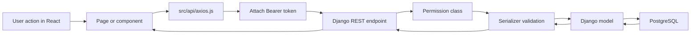
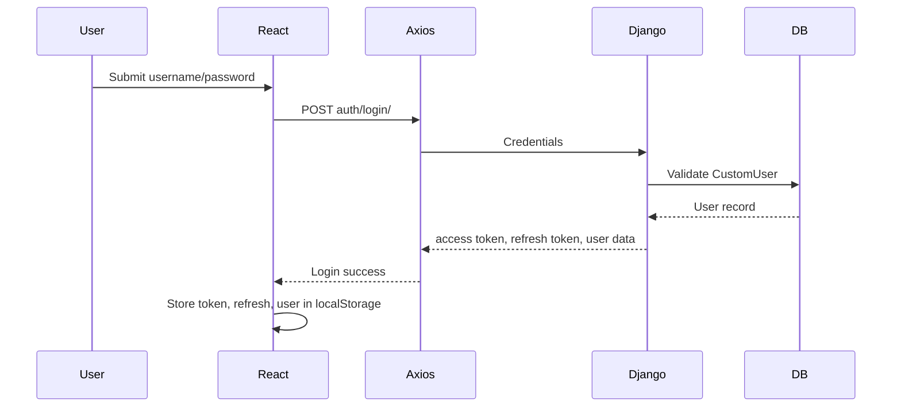
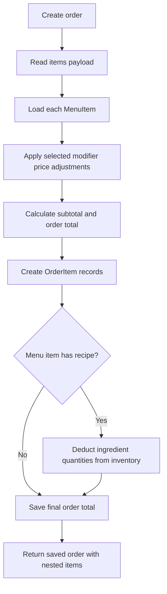

# System Data Flow

Last updated: May 26, 2026

This document explains how the Cafeteria Project Management System works from browser actions to API calls, backend permissions, serializers, models, and PostgreSQL storage.

## High-Level Flow

## Authentication Flow

The Axios client attaches the access token to every API request. If a request returns `401`, it tries `auth/refresh/` using the refresh token, updates storage, and retries the original request. If refresh fails, it clears local storage and redirects to `/login`.

## Role and Permission Flow

| Role | Typical access |
| --- | --- |
| Admin | Full access, including deletes and system management |
| Manager | Management access for menu, inventory, employees, salaries, reports, and newsletter reads |
| Staff/Employee | Authenticated read access and order workflow access, with restricted admin actions |

Important backend permission classes:

- `IsAdminRole`: Admin only.
- `IsManagerOrAdmin`: Manager or Admin.
- `IsManagerOrAdminOrReadOnly`: authenticated reads, Manager/Admin writes.
- `IsAdminOrDeleteDenied`: authenticated users can create/read/update, only Admin can delete.

## Feature Data Flow

| User action | Frontend source | API call | Backend handler | Database effect |
| --- | --- | --- | --- | --- |
| Login | `Login.jsx`, `AuthContext.jsx` | `POST auth/login/` | `CustomTokenObtainPairView` | Reads `accounts_customuser` |
| Google email check | `Login.jsx` | `POST auth/check-email/` | `CheckEmailView` | Reads `accounts_customuser` |
| Google login | `AuthContext.jsx` | `POST auth/google-social-login/` | `GoogleSocialLoginView` | Reads `accounts_customuser` |
| Update profile | `Settings.jsx` | `PATCH auth/users/:id/` | `UserViewSet` | Updates `accounts_customuser` |
| Create system user | `Settings.jsx` | `POST auth/users/` | `UserViewSet` | Inserts `accounts_customuser` |
| Delete system user | `Settings.jsx` | `DELETE auth/users/:id/` | `UserViewSet` | Deletes `accounts_customuser` |
| Submit contact form | `Contact.jsx` | `POST menu/contact-messages/` | `ContactMessageViewSet` | Inserts `menu_contactmessage` |
| Review contact messages | `ContactMessages.jsx`, `Settings.jsx` | `GET menu/contact-messages/` | `ContactMessageViewSet` | Reads `menu_contactmessage` |
| Delete contact message | `ContactMessages.jsx`, `Settings.jsx` | `DELETE menu/contact-messages/:id/` | `ContactMessageViewSet` | Deletes `menu_contactmessage` |
| Subscribe newsletter | `PublicLayout.jsx` | `POST menu/newsletter-subscriptions/` | `NewsletterSubscriptionViewSet` | Inserts or reuses `menu_newslettersubscription` |
| Review newsletter subscriptions | `SystemMessages.jsx` | `GET menu/newsletter-subscriptions/` | `NewsletterSubscriptionViewSet` | Reads `menu_newslettersubscription` |
| Delete newsletter subscription | `SystemMessages.jsx` | `DELETE menu/newsletter-subscriptions/:id/` | `NewsletterSubscriptionViewSet` | Deletes `menu_newslettersubscription` |
| Submit job application | `JobApplication.jsx` | `POST menu/job-applications/` | `JobApplicationViewSet` | Inserts `menu_jobapplication`, stores CV media |
| Review job applications | `Jobs.jsx`, `Reports.jsx` | `GET menu/job-applications/` | `JobApplicationViewSet` | Reads `menu_jobapplication` |
| Update job status | `Jobs.jsx` | `PATCH menu/job-applications/:id/` | `JobApplicationViewSet` | Updates `menu_jobapplication.status` |
| Load menu | `Menu.jsx`, `Reports.jsx` | `GET menu/` | `MenuItemViewSet` | Reads `menu_menuitem` and `menu_category` |
| Add/edit menu item | `Menu.jsx` | `POST/PATCH menu/` | `MenuItemViewSet` | Inserts/updates menu item, category, image |
| Toggle menu item | `Menu.jsx` | `PATCH menu/:id/toggle/` | `MenuItemViewSet.toggle` | Updates `menu_menuitem.status` |
| Delete menu item | `Menu.jsx` | `DELETE menu/:id/` | `MenuItemViewSet` | Deletes `menu_menuitem` |
| Load tables | `Menu.jsx` | `GET orders/tables/` | `TableViewSet` | Reads `orders_table` |
| Place POS order | `Menu.jsx`, `Orders.jsx` | `POST orders/` | `OrderViewSet` and `OrderSerializer.create` | Inserts order/items, calculates total, deducts recipe inventory |
| Update order status | `Orders.jsx` | `PATCH orders/:id/status/` | `OrderViewSet.status` | Updates `orders_order.status` |
| Delete order | `Orders.jsx` | `DELETE orders/:id/` | `OrderViewSet` | Deletes order and order items |
| Load inventory | `Inventory.jsx`, `Reports.jsx` | `GET inventory/` | `InventoryItemViewSet` | Reads `inventory_inventoryitem` |
| Add/edit inventory | `Inventory.jsx` | `POST/PATCH inventory/` | `InventoryItemViewSet` | Inserts/updates `inventory_inventoryitem` |
| Delete inventory item | `Inventory.jsx` | `DELETE inventory/:id/` | `InventoryItemViewSet` | Deletes `inventory_inventoryitem` |
| Load employees | `Employees.jsx`, `Orders.jsx`, `Salaries.jsx` | `GET employees/` | `EmployeeViewSet` | Reads `employees_employee` |
| Add/edit employee | `Employees.jsx` | `POST/PATCH employees/` | `EmployeeViewSet` | Inserts/updates `employees_employee` |
| Toggle employee status | `Employees.jsx` | `PATCH employees/:id/toggle/` | `EmployeeViewSet.toggle` | Updates `employees_employee.status` |
| Delete employee | `Employees.jsx` | `DELETE employees/:id/` | `EmployeeViewSet` | Deletes `employees_employee` |
| Load salaries | `Salaries.jsx`, `Reports.jsx` | `GET salaries/` | `SalaryRecordViewSet` | Reads `salaries_salaryrecord` |
| Add/edit salary | `Salaries.jsx` | `POST/PATCH salaries/` | `SalaryRecordViewSet` | Saves salary and recalculates net salary |
| Delete salary | `Salaries.jsx` | `DELETE salaries/:id/` | `SalaryRecordViewSet` | Deletes salary record |
| Load dashboard KPIs | `Dashboard.jsx` | `GET dashboard/stats/` | `DashboardStatsView` | Aggregates orders, employees, inventory |

## External API Connections

The project currently has one external API call:

- Google ID token verification in `accounts/views.py` calls `https://oauth2.googleapis.com/tokeninfo` when `DEBUG=False` or when the credential is not a local mock token.

The payment modal does not call an external payment API. It collects the selected payment method and passes it into the saved order payload.

## Local-Only Frontend State

These controls do not require database storage:

- Theme mode, accent color, sound type, and performance mode.
- Avatar preview in Settings.
- Report CSV export and print actions.
- Modal open/close state, filters, search, sort, and pagination.

## Order and Inventory Deduction Flow

## Documentation Links

- [Backend architecture](backend.md)
- [Database schema](database.md)
- [Run guide](run.md)
- [Test guide](test.md)
- [Render deployment](render.md)
- [Frontend architecture](../../frontend/docs/frontend.md)
