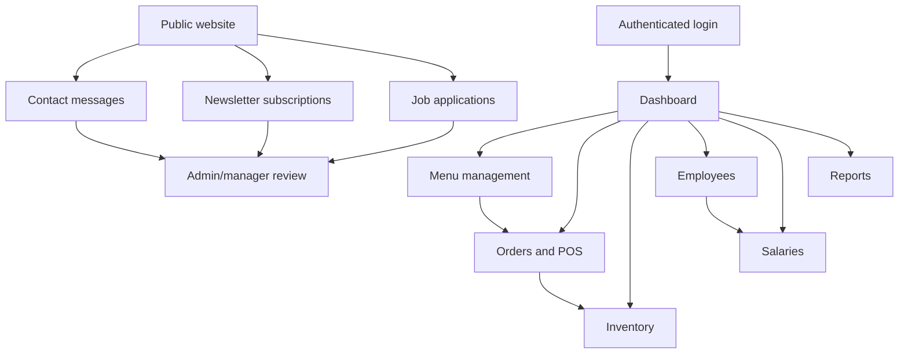

# Project System Overview

Last updated: May 26, 2026

This document summarizes how the Catateria Project Management System is organized, who owns each area, and how the system works at a business level.

## Purpose

The system supports cafeteria operations from the public website through authenticated back-office management:

- Public visitors can view the site, send contact messages, subscribe to the newsletter, and apply for jobs.
- Staff can log in, view operational data, and create orders.
- Managers can manage menu, inventory, employees, salaries, and reporting areas.
- Admin users can manage system users, deletes, job applications, and restricted message records.

## System Areas

| Area | What it does | Main docs |
| --- | --- | --- |
| Frontend | Browser UI, routing, forms, tables, filters, reports | [Frontend architecture](../../frontend/docs/frontend.md) |
| Backend | REST API, permissions, serializers, business rules | [Backend architecture](backend.md) |
| Database | PostgreSQL schema and relationships | [Database schema](database.md) |
| Data flow | How UI actions move through API to database | [System data flow](data_flow.md) |
| Testing | Build, lint, Django checks, automated tests | [Testing guide](test.md) |
| Deployment | Render services and environment variables | [Render guide](render.md) |

## Team Ownership

| Role | Team member |
| --- | --- |
| Admin and Manager | Abdiladiif |

### Frontend Development

| Team member |
| --- |
| Amiin Jirde |
| Fu Aad |
| Abdirahmaan |

### Backend Development

| Team member |
| --- |
| Abdifataah Omar |
| Abdifataah Mahamed |

### Database Management

| Team member |
| --- |
| Muhamed Mawliid |

### Quality Assurance and Testing

| Team member |
| --- |
| Mahamuud |

## Operational Workflow

## Current Health

Current local verification:

- Frontend lint passed.
- Frontend build passed.
- Backend system check passed.
- Backend migrations check passed.
- Backend tests passed with 48 tests.

## Notes

- Demo users are seeded intentionally through scripts or optional local `CREATE_DEMO_USERS=true`.
- Production should keep demo auto-creation disabled.
- The payment modal stores selected payment metadata with orders, but it is not integrated with an external payment processor.
